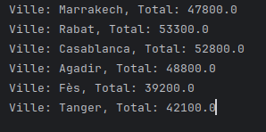
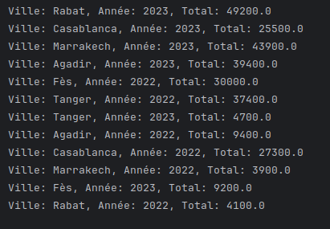

# 🧠 Activité Pratique : Traitement parallèle et distribué avec Apache Spark en Java

Ce dépôt contient la solution de l'activité pratique portant sur le traitement parallèle de données avec le framework **Apache Spark**, en utilisant le langage **Java**.  
Ce TP est réalisé dans le cadre du cours de **Big Data** dispensé par **Mr Abdelmajid BOUSSELHAM**.

---

## 🎯 Objectif

L’objectif de ce TP est d’implémenter deux applications Spark pour effectuer des analyses sur un fichier de ventes (`ventes.txt`) contenant les opérations commerciales d’une entreprise réparties sur plusieurs villes et années.

Les deux objectifs spécifiques sont :

1. **Calculer le total des ventes par ville**
2. **Calculer le total des ventes par ville et par année**

---

## 📁 Structure du Fichier `ventes.txt`

Chaque ligne du fichier représente une vente sous le format suivant :

Exemple :


- `date` : date de la vente (format AAAA-MM-JJ)  
- `ville` : ville où la vente a eu lieu  
- `produit` : produit vendu  
- `prix` : montant de la vente (en dirhams)

---

## ⚙️ Technologies utilisées

- 💻 Java 8+
- ⚡ Apache Spark (API Java)
- ☕ IntelliJ IDEA / Eclipse
- 📦 Maven pour la gestion des dépendances

---

## 📂 Structure du Projet

spark-ventes-tp/ ├── src/ │ └── main/ │ └── java/ │ └── org/ │ └── example/ │ ├── App1.java # Ventes par ville │ └── App2.java # Ventes par ville et par année ├── ventes.txt # Fichier de données ├── pom.xml # Configuration Maven └── README.md # Fichier de documentation


---

## 📌 Détail des classes

### 1. `App1.java` : Total des ventes par ville

- Lit le fichier `ventes.txt`
- Extrait la ville et le prix
- Calcule le total des ventes par ville à l’aide de RDDs

### 2. `App2.java` : Total des ventes par ville et par année

- Extrait l’année à partir de la date
- Utilise une clé composite `(ville, année)`
- Agrège les ventes par ville et année
---

## Captures d'écran

| Total ventes par ville | Total ventes par ville et par année | 
|---|---|
|  |  | 

## ▶️ Instructions d’Exécution
1. **Cloner le dépôt** :
   ```bash
      git clone https://github.com/ouss-issib/tp-ApacheSpark.git
      
2. Naviguer dans le répertoire du dépôt :
   ```bash
   cd tp-ApacheSpark  

3. Compiler et exécuter les fichiers Java :
   ```bash
    mvn clean install
    spark-submit --class org.example.App1 target/spark-ventes-tp-1.0-SNAPSHOT.jar
    # ou
    spark-submit --class org.example.App2 target/spark-ventes-tp-1.0-SNAPSHOT.jar

